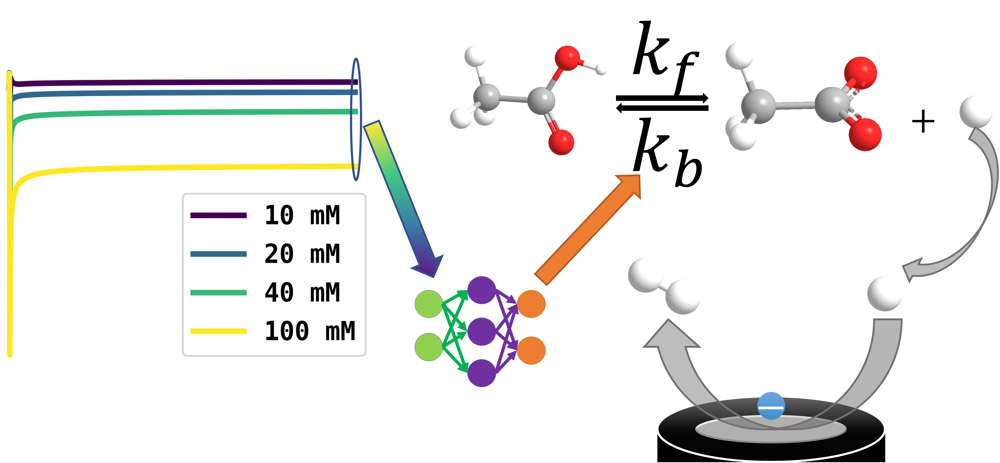

# Acetic-Acid-Dissociation-AI

The code repository to for extracting thermal and kinetic rate constants of dissociation of acetic acid using a simulation and machine learning approach. This repository is for "Experimental Voltammetry Analyzed Using Artificial Intelligence: Thermodynamics and Kinetics of the Dissociation of Acetic Acid in Aqueous Solution" submitted to *Analytical Chemistry*.

# Experimental Data
The experimental data for chronoamperometry described in paper at four concentrations of acetic acid (10 mM, 20mM, 40 mM and 100 mM). The steady state currents are thus obtained and used as features for the AI.

# PythonScripts 

* **main.py** The main file to start simulation of acetic acid dissociation at different combination of rate and equilibrium constants. A total of 50,000 simulations were performed by the authors. It uses multiprocessing to speed us simulations. The more CPU cores, the faster! Simulations are supposed to be consistent in different computer platforms.
* **simulation.py** Handy if you want start just one simulation.

## Machine Learning
Machine learning program for the paper. **Please note that due to stochastic nature of neural networks and difference of hardware and operation system, your results may slighly vary from the authors. Generally less than 0.1 in log10 scale.**
* *features.csv* Please note that due to the size limit of a GitHub repository, we can not upload full training dataset from our simulation, but the features we extracted from our simulations. You are encouraged to use your own simulations to reproduce the results. *ExtractFeatures.py* would be used for feature engineering from simulation files. 
* *Predict Constants.py* The tensorflow program to predict rate and equilibrium constants. It is first trained using features generated from simulations. 
* *plot current surface.py* can plot the features: the steady state currents, generated from simulation, at different combination of rate and equilibrium constants. 
* *EvaluateResults.py* evaluates the NN using the test data generated from training.
* *Experimental Results.csv* is the experimental feature based on to predict rate and equilibrium constants.

**requirement.txt** The python packages the author used in a Python 3.7.3 conda environment.

---
You may cite the paper as acknowledgement to the authors if you find this helpful. 

Paper url: [Link](https://pubs.acs.org/doi/abs/10.1021/acs.analchem.2c00110)

If you have any technical questions, please post them in the discussion forum of this repository. We will closely monitor the discussion forum and respond to questions as fast as we can.

For general enquiry, please email [Professor Richard Compton](mailto:richard.compton@chem.ox.ac.uk).

